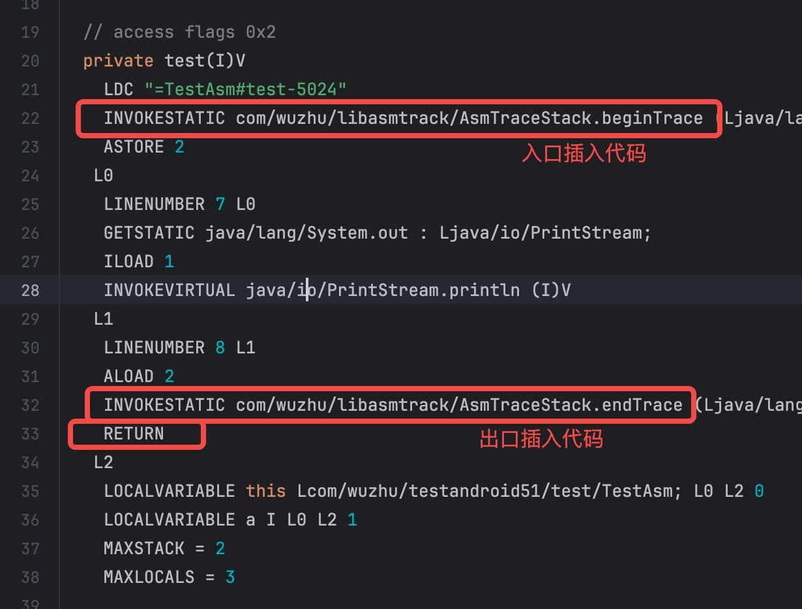
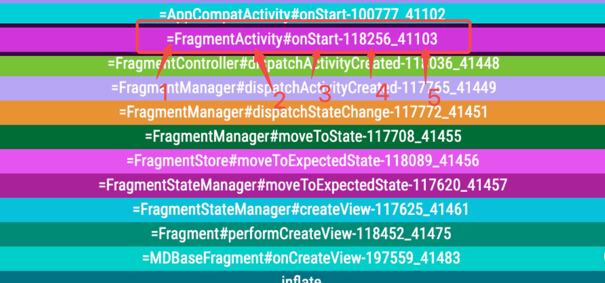
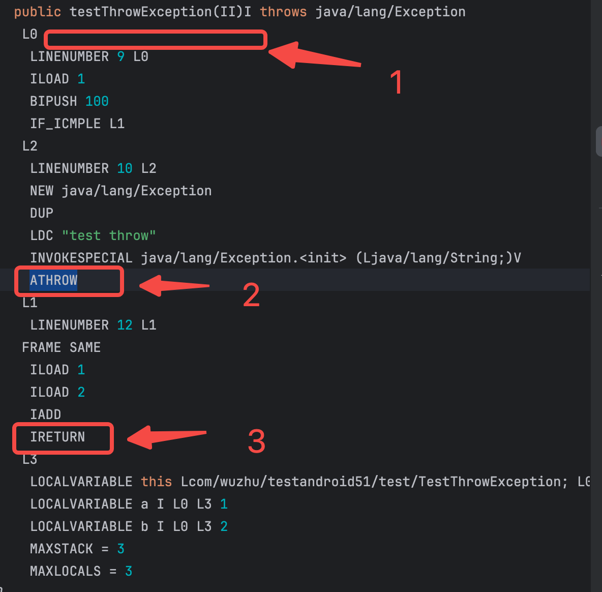
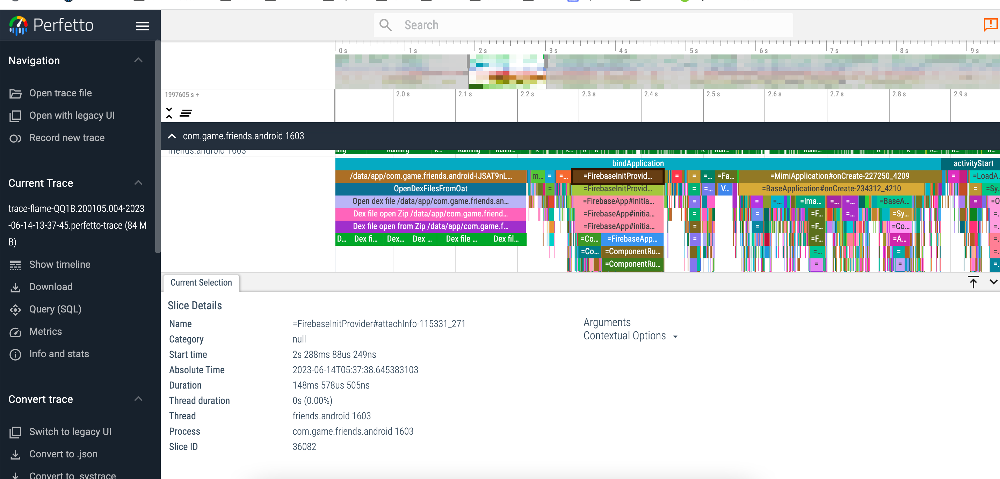

# <center> AsmTrace 实现原理


涉及知识点：<br>
gradle 插件开发。<br>
asm修改字节码。了解一些字节码知识。<br>
小工具：<br>
android studio查看字节码插件：ASM Bytecode Viewer<br>


## 1.概述
&emsp; &emsp; 实现一个gradle插件，通过Asm对所有类的方法插桩。  
在方法的入口插入代码：Trace.beginSection("className#$methodName")  
在方法的出口插入代码：Trace.endSection()

<br>
ps：AsmTraceStack.beginTrace，AsmTraceStack.endTrace中分别调用了Trace.beginSection，Trace.endSection

## 2.项目结构
AsmTrackPlugin:gradle插件  
lib_asmtrack:java module,要插桩的类，以及trace相关逻辑。

## 2.插件实现
### 2.1 编写Plugin，Transform

编写gradle Plugin，通过Transform，遍历所有文件夹中的类，以及jar包中的类，对每个类的方法插桩。

```groovy
class AsmTrackPlugin implements Plugin<Project> {
    void apply(Project project) {
        ...
            //register this plugin
            android.registerTransform(transformImpl)
        ...
    }
}
```

```groovy
class ASMTransform extends Transform {

    ...

    // 核心方法
    @Override
    void transform(TransformInvocation transformInvocation) throws TransformException, InterruptedException, IOException {
        super.transform(transformInvocation)
        ...
        // 获取输入源
        Collection<TransformInput> inputs = transformInvocation.getInputs()

        ClassLoader classLoader = createClassLoader(project, inputs)

        inputs.forEach(transformInput -> {
            //处理所有文件夹中的类
            transformInput.getDirectoryInputs().forEach(directoryInput -> {
                try {
                    System.out.println("------directoryInput = " + directoryInput)
                    HandleDirectoryInputBusiness.traceDirectory(classLoader, directoryInput,
                            transformInvocation.getOutputProvider(),
                            new Config())
                } catch (IOException e) {
                    ...
                }
            })

            //处理所有jar包中的类
            transformInput.getJarInputs().forEach(jarInput -> {
                try {
                    System.out.println("------jarInput = " + jarInput)
                    HandleJarInputBusiness.traceJarFiles(classLoader, jarInput,
                            transformInvocation.getOutputProvider(),
                            new Config())
                } catch (IOException e) {
                    ...
                }
            })

        })
    }

    ...

}

```

### 2.2 函数插桩

通过MethodVisitor，访问函数入口和出口，分别插入相应代码。  
实现类：com.wuzhu.asmtrack.MethodEnterAndExitAdapter
```java
public class MethodEnterAndExitAdapter extends AdviceAdapter {

    private final String className;
    private final String methodName;
    private final int localVarSlot;

    public MethodEnterAndExitAdapter(final int api, final MethodVisitor mv,
                                     final int access, final String methodName, final String desc,
                                     final String className) {
        super(api, mv, access, methodName, desc);
        this.className = className;
        this.methodName = methodName;
        //增加一个本地变量槽
        localVarSlot = newLocal(Type.getType(String.class));
    }

    @Override
    protected void onMethodEnter() {
        super.onMethodEnter();
        //函数入口插桩trace begin
        insertBeginSection();
    }

    private void insertBeginSection() {
        String traceName = InsertCodeUtils.generatorName(className, methodName);
        InsertCodeUtils.insertBegin(traceName, mv, localVarSlot);
    }

    @Override
    protected void onMethodExit(int opcode) {
        super.onMethodExit(opcode);
        //函数出口插桩trace end
        insertEndSection();
    }

    private void insertEndSection() {
        InsertCodeUtils.insertEnd(mv, localVarSlot);
    }

}


```

### 2.3 插桩实现

#### 2.3.1.trace名称生成规则。


<br>
=FragmentActivity#onStart-118256_41103

1."=":用于区分是自己插入的trace还是android系统trace。<br>
2.类名，不包含包名。<br>
3.方法名。<br>
4.遍历每个方法时，生成的num，可用于区分重载的函数。<br>
5.运行时，进入函数时，生成的num，用于区分递归调用。<br>
正常的递归调用，没有这一部分也能正常work；<br> 
但是出现异常时，这部分能保证trace的正确性。<br>


#### 2.3.2.插桩实现

```java

    @JvmStatic
    fun beginTrace(name: String?):String? {
        ...
        return newName
    }

    
    @JvmStatic
    fun endTrace(newName: String?) {
        ...
    }

```
以上是要插桩的java源码，注意beginTrace有返回值，返回值会作为参数传递给endTrace。
对于一个函数，插桩前后会是下面的样子：  

插桩前：  
```java
    private void test(int a) {
        System.out.println(a);
    }
```

插桩后：  
```java
    private void test(int a, int b) {
        String var3 = AsmTraceStack.beginTrace("=TestAsm#test-5025");
        System.out.println(a + b);
        AsmTraceStack.endTrace(var3);
    }
```

从插桩后的代码可以看出，会增加一个局部变量var3。

 
```java
    //com.wuzhu.asmtrack.utils.InsertCodeUtils

    @JvmStatic
    fun insertBegin(traceName: String, methodVisitor: MethodVisitor, localVarSlot: Int) {
        println("------=== name = $traceName")
        methodVisitor.visitLdcInsn(traceName)
        methodVisitor.visitMethodInsn(
            INVOKESTATIC,
            "com/wuzhu/libasmtrack/AsmTraceStack",
            "beginTrace",
            "(Ljava/lang/String;)Ljava/lang/String;",
            false
        )
        //将返回值，存到新增的局部变量
        methodVisitor.visitVarInsn(ASTORE, localVarSlot)
    }

    @JvmStatic
    fun insertEnd(methodVisitor: MethodVisitor, localVarSlot: Int) {
        //读取新增的局部变量
        methodVisitor.visitVarInsn(ALOAD, localVarSlot)
        methodVisitor.visitMethodInsn(
            INVOKESTATIC, "com/wuzhu/libasmtrack/AsmTraceStack", "endTrace", "(Ljava/lang/String;)V", false
        )
    }


```
以上是插桩代码，这句代码“methodVisitor.visitVarInsn(ASTORE, localVarSlot)”，会将AsmTraceStack.beginTrace返回值，存到新增的局部变量，asm会重新计算栈帧（重新计算局部变量表和操作数栈）。  
LocalVariablesSorter参考文章：[Java ASM系列：（039）LocalVariablesSorter介绍](https://blog.51cto.com/lsieun/2980222)


## 3.方法异常trace end处理
### 3.1 问题
一个java方法，只有一个入口，但是出口，可能有两个：
1.正常return；2.抛出异常。  
<br>
<br>
上图字节码对应的java代码：
 
```java
    public int testThrowException(int a, int b) throws Exception {
        if (a > 100) {
            throw new Exception("test throw");
        } else {
            return a + b;
        }
    }
```
原本的方案是：  
在入口1处，插入Trace.beginSection。  
在入口 2 & 3 出，分别插入Trace.endSection。  
对于上面那种显示定义了"throw new Exception..."，可以保证begin，end成对调用；  
但是，对于运行时抛出的异常，无法处理，最终会导致Trace.endSection调用次数 < Trace.beginSection,导致的后果就是：出现运行时异常时，很多函数没有正常end。
<br>

### 3.2 解决方案
每个函数生成一个唯一name标识（见2.3.1.trace名称生成规则），定义一个栈，进入函数时，将name入栈，函数结束时，去栈中找对应的name，找到后，栈中name及以上全部出栈。如此，即使中间函数出现异常，缺少调用Trace.endSection，但当有函数正常结束时，会多次调用Trace.endSection，从而保证Trace.beginSection & Trace.endSection一一对应。
详细实现见：com.wuzhu.libasmtrack.AsmTraceStack
<br>
<br>
<br>
<br>
<br>
<br>
<br>
<br>
<br>
<br>
<br>
<br>
<br>
<br>

# <center>AsmTrace 使用说明

## 1 适用场景
插件适用于debug环境中，对于已知卡顿场景，能检测出所有函数耗时情况（除了android系统函数），通过perfetto，打开函数时序图，可精确定位哪个方法耗时。
例如：
启动优化（能统计出所有启动时的函数耗时情况）。
切换Activity慢。
列表快速滑动等等已知卡顿场景。  

此插件不建议release中使用。

## 2 插件使用
### 2.2 初始化
在application中调用 com.wuzhu.libasmtrack.AsmTraceInitializer.init 


## 3 性能分析
[Perfetto入门](https://www.jianshu.com/p/f4cf101cc64f)<br>
[Perfetto官网](https://ui.perfetto.dev/)<br>
Perfetto trace 数据保存位置 /data/local/traces<br>
拉取trace数据：  
adb pull /data/local/traces<br>

效果图:  


## 4 相比与Debug.startMethodTracing，Debug.startMethodTracingSampling优势。
Debug trace 存在的问题：
1. Debug.startMethodTracing有兼容性问题，有些手机录制的Trace文件，profile打不开。
2. 对于性能一般的手机，检测功能复杂的界面时，直接卡到无法使用。
   使用Debug.startMethodTracingSampling，增大采样间隔卡顿问题能缓解一些，但是又会丢失精度，测试了一个性能差的手机，间隔要1s卡顿才能缓解。
   ps:Debug.startMethodTracingSampling 会 suspend all thread。

本插件解决的问题：  
插件虽然会整体拖慢执行速度，但不会像Debug.startMethodTracing那样直接卡到无法使用，且没有兼容性问题，没有采样精度问题。  


ps:如图  
AsmTrace插件是对“System Trace”的扩展。  
Debug.startMethodTracing 对应的是 “Java/Kotlin Methode Trace”。  
Debug.startMethodTracingSampling 对应的是 “Java/Kotlin Methode Sample”。  

# TODO 
发布到maven仓库。  

