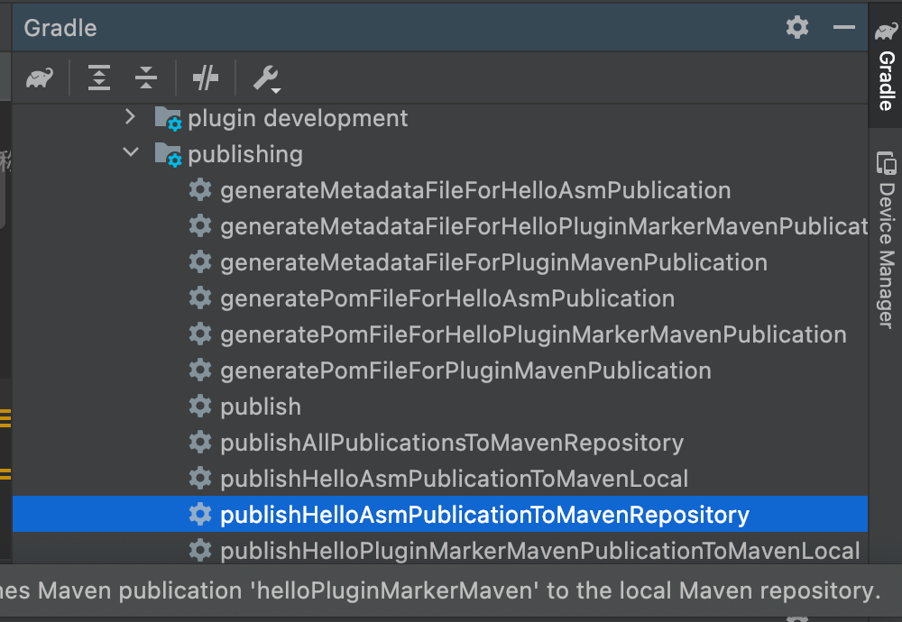
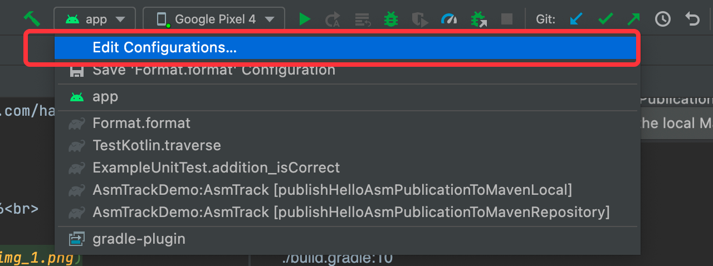
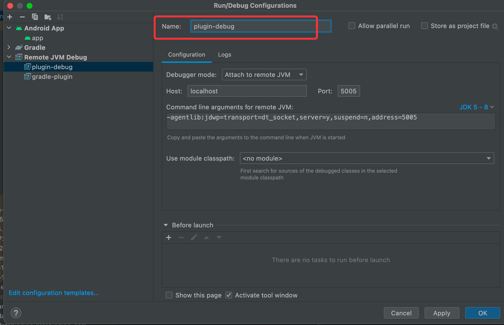
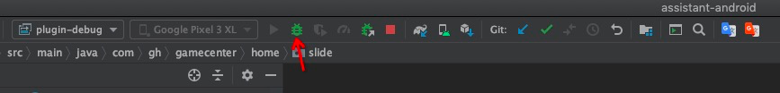

github地址：https://github.com/light-echo-3/AsmTraceDemo

# 1.编译并发布插件  
## 1.1 修改插件版本
./AsmTrackPlugin/build.gradle:51<br>


## 1.2 编译并发布到repo仓库  
./gradlew :AsmTrack:publishHelloAsmPublicationToMavenRepository
or<br>


## 1.3 使用插件  
./build.gradle:10<br>


# 2.调试插件
## 2.1.点击Edit Configurations


## 2.2.点击+号，选择Remote


## 2.3.随意输入名称，其他参数不要动


## 2.4.然后在Terminal中输入如下命令
```
./gradlew --no-daemon -Dorg.gradle.debug=true :app:{taskName}
```
taskName是我们调试的task，比如assembleDebug、assembleRelease等  
例如：  
```
./gradlew --no-daemon -Dorg.gradle.debug=true clean :app:assembleDebug
```
输入命令后调试进程处于阻塞状态：


## 2.5.最后在你想要调试的地方加上断点，点击调试按钮，这样就可以愉快的开始调试了。



## 2.6 测试插件是否发布成功
1. 修改log:com/wuzhu/asmtrack/AsmTrackPlugin.groovy:28
2. 发布插件
3. 执行命令：  
./gradlew testPluginPublishSuccess  
查看日志是否是最新的。

## 2.7 发布到github
[发布包到 GitHub Packages](https://docs.github.com/zh/actions/publishing-packages/publishing-java-packages-with-gradle#%E5%8F%91%E5%B8%83%E5%8C%85%E5%88%B0-github-packages)  
[gradle发布jar到GitHub Packages & 使用](https://juejin.cn/post/7007289428158709797)

# 3 插件使用
## 3.1 初始化
在application中调用 com.wuzhu.libasmtrack.AsmTraceInitializer.init 


# 4 性能分析
[Perfetto入门](https://www.jianshu.com/p/f4cf101cc64f)<br>
[Perfetto官网](https://ui.perfetto.dev/)<br>
Perfetto trace 数据保存位置 /data/local/traces<br>
adb pull /data/local/traces<br>


# 5 相比与Debug.startMethodTracing，Debug.startMethodTracingSampling优势。
Debug trace 存在的问题：
1. Debug.startMethodTracing有兼容性问题，有些手机录制的Trace文件，profile打不开。
2. 对于性能一般的手机，检测功能复杂的界面时，直接卡到无法使用。
   使用Debug.startMethodTracingSampling，增大采样间隔卡顿问题能缓解一些，但是又会丢失精度，测试了一个性能差的手机，间隔要1s卡顿才能缓解。
   ps:Debug.startMethodTracingSampling 会 suspend all thread。

本插件解决的问题：  
插件虽然会整体拖慢执行速度，但不会像Debug.startMethodTracing那样直接卡到无法使用，且没有兼容性问题，没有采样精度问题。  


ps:如图  
插件是对“System Trace”的扩展。  
Debug.startMethodTracing 对应的是 “Java/Kotlin Methode Trace”。  
Debug.startMethodTracingSampling 对应的是 “Java/Kotlin Methode Sample”。  

# TODO 
